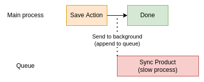
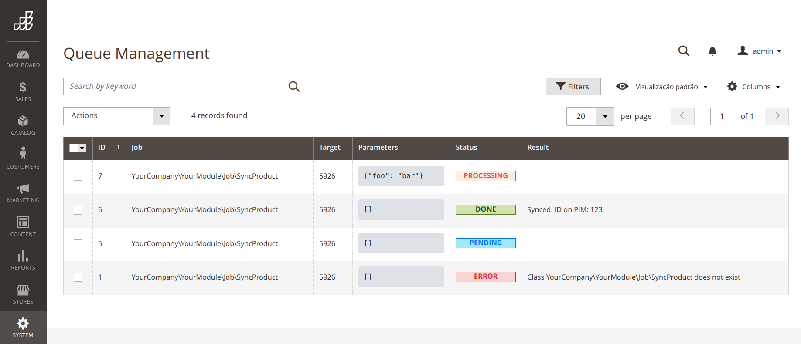

<p align="center">A dev-friendly approach to handle background jobs in Magento 2</p>

<p align="center">
    
    
    <a target="_blank" href="https://packagist.org/packages/discorgento/module-queue"></a>
    <a target="_blank" href="https://discord.io/Discorgento"></a>
</p>

## Overview 💭
Now and then we need to create processes that can take some time to execute, and that doesn't necessarily need to be done in real time. Like (but not limited to) third-party integrations.

For example, let's say you need to reflect product changes made by the storekeeper through the admin panel to their PIM/ERP. You can observe the `catalog_product_save_after` event and push the changes, but this would make the "Save" admin action become a hostage of the third-party system response time, potentially making the store admin reeealy slow.


But fear not citizens, because [we](https://discord.io/Discorgento) are here!  


## Install 🔧
This module is compatible with both Magento 2.3 and 2.4, from PHP 7.2 to 8.1.
```
composer require discorgento/module-queue:^3 && bin/magento setup:upgrade
```

## Usage ⚙️
There's just two steps needed: 1) append a job to the queue, 2) create the job class itself ([similar to Laravel](https://laravel.com/docs/9.x/queues#class-structure)).



> 💡 **Tip:** for 2.x version please refer to the old docs [here](https://github.com/discorgento/module-queue/blob/2.0.4/README.md#usage-%EF%B8%8F). Just remember: the current version is 100% retrocompatible, so you can upgrade (by running the install command above) and use all the new features without breaking your existant code!

Let's go back to the product sync example. You can now write the `catalog_product_save_after` event observer like this:

```php
<?php declare(strict_types=1);
/** Copyright © Discorgento. All rights reserved. */

namespace YourCompany\YourModule\Observer;

use Discorgento\Queue\Api\QueueManagementInterface;
use Magento\Framework\Event;

class ProductSaveAfter implements Event\ObserverInterface
{
    private QueueManagementInterface $queueManagement;

    public function __construct(
        QueueManagementInterface $queueManagement
    ) {
        $this->queueManagement = $queueManagement;
    }

    /** @inheritDoc */
    public function execute(Event\Observer $observer) {
        // append a job to the queue so it will run in background
        $this->queueManagement->append(
            // your job class, we'll create it later
            \YourCompany\YourModule\Job\SyncProduct::class,
            // a identifier of the entity we'll be working with
            $observer->getProduct()->getId(),
            // additional data for later usage (optional)
            ['foo' => $observer->getFoo()]
        );
    }
}
```

<br>
Now create the job itself, let's say <i>app/code/YourCompany/YourModule/Job/SyncProduct.php</i>:

```php
<?php declare(strict_types=1);
/** Copyright © Discorgento. All rights reserved. */

namespace YourCompany\YourModule\Job;

use Discorgento\Queue\Api\JobInterface;
use Magento\Catalog\Api\ProductRepositoryInterface;
use YourCompany\YourModule\Gateway\ProductSyncer;

// the job MUST implement the JobInterface
class SyncProduct implements JobInterface
{
    private ProductRepositoryInterface $productRepository;
    private ProductSyncer $productSynchronizer;

    public function __construct(
        ProductRepositoryInterface $productRepository,
        ProductSyncer $productSynchronizer
    ) {
        $this->productRepository = $productRepository;
        $this->productSynchronizer = $productSynchronizer;
    }

    /** @inheritDoc */
    public function execute($target, $additionalData)
    {
        // retrieve the target product
        $product = $this->productRepository->getById($target);

        // sync it to a third-party PIM/ERP
        $response = $this->productSynchronizer->sync($product);

        // NEW!! now you can optionally return a string as the job "result".
        // This will be shown at admin in "System->(Tools) Queue Management"
        return "Synced. ID on PIM: {$response->pim_id}";
    }
}
```

And.. that's it! In the next cron iteration (which should be within the next minute) your job will be executed without compromising the performance of the store at all, assuring a smooth workflow for both your clients and their customers.

> 💡 **Tip:** any async process can benefit from this approach, your creativity is the limit.

## Managing the queue
You can check for pending, executed, or failed jobs at our brand new Queue Management grid.  
It can be accessed through the "System->(Tools) Queue Management" menu (near to the native cache/index management entries):


## Footer notes 🗒
 - Magento can do this natively through [Message Queues](https://devdocs.magento.com/guides/v2.4/extension-dev-guide/message-queues/message-queues.html), but those are ridiculously verbose to use;
 - issues and PRs are welcome in this repo;
 - we want **YOU** for [our community](https://discord.io/Discorgento);
